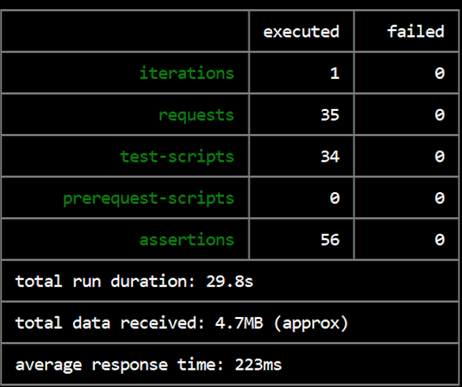

@title[Introduction]
## espressoyoself.me

### Coffee With A View

---
## What Are We?

We allow the user to find a place to grab a coffee, and then head over to a nearby scenic view to enjoy it at. With the help of Google Places, Yelp, and Flickr we've used the power of location so that you can find a sip and a relaxing spot wherever you are. 
---

## Developers: The Cool Beans
 
**Amrutha Sreedharane** | *Backend* 
 
 
**Jaemin Goh**          | *Backend | Frontend*
 
 
**Jenni Rethi**         | *Backend | Frontend*
 
 
**Sonam Benakatti**     | *Frontend*
 
 
**Ruchi Shekar**        | *Frontend*

---
## Demonstration

[espressoyoself.me](http://espressoyoself.me)

---
#### Mocha

---
#### Selenium

---
#### Postman

---
#### unittest

---

## Self Critique

- **What did we do well?**
  - Communicated well and evenly distributed the work
  - Started early on the projects
  - Asked questions when we got stuck

- **What did we learn?**
  - Learned a lot of new languages and frameworks
  - Learned how to create a dynamic website from scratch

---

## Self Critique

- **What can we do better?**
  - Could have researched the frameworks more before starting
  - Could have added more features/visualizations
  - Could have made our website more consistent throughout

- **What puzzles us?**
  - Webpack and the bundle.js
  - Merge conflicts and handling them properly
  - How to keep state of filters and sorts

---

## Are We There Yet? Critique

- **What did they do well?**
  - Their website looks very clean and put together
  - Very useful idea
  - Ties all three of their models together really well

- **What did we learn from their API/website?**
  - Learned about flask-restless
  - Learned about react-js-pagination

---

## Are We There Yet? Critique

- **What can they do better?**
  - Cross browser and mobile compatiblity
  - Better formatting on instance pages
  - Include the state on restaurants instances on model page

- **What puzzles us about their API/website?**
  - Don't know why website displays unformatted HTML first
  - Don't know why it has inconsistencies on multiple browsers

---
## Visualization

[espressoyoself.me/visualization](http://espressoyoself.me/visualization)

---
## Thanks!
